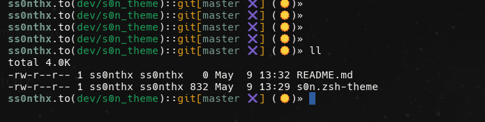

# s0n

A minimalist custom theme for Oh My Zsh.

`s0n` is a lightweight and clean terminal theme designed for developers who prefer a minimal prompt with useful information at a glance.

## Features

* Minimalist design
* Git branch display
* Icons support
* Current time indicator
* Fast and lightweight
* Clean developer experience

## Preview



## Installation

Clone repository:

```bash id="h0qf5z"
git clone git@github.com:themax/xthe_theme_zsh.git
```

Move theme file:

```bash id="q36l9e"
cp s0n.zsh-theme ~/.oh-my-zsh/themes/
```

Set theme in `.zshrc`:

```bash id="m7g67q"
ZSH_THEME="s0n"
```

Reload terminal:

```bash id="t1k3w6"
source ~/.zshrc
```

## Requirements

* Zsh
* Oh My Zsh
* Nerd Font (recommended for icons)

## Author

Created by **Ss0nth**
